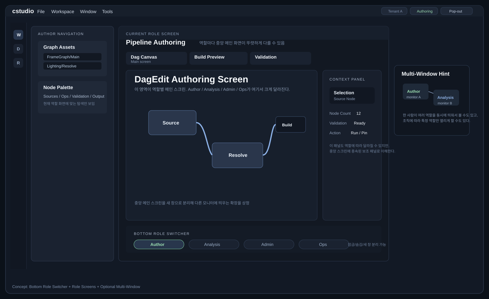

# 하단 Role Switcher UI 컨셉 v1

이 문서는 `cstudio`를 하단 Role Switcher 기반 멀티 스크린 워크스테이션으로 해석한 UI 시안이다.

미리보기 자산:

## 핵심

- 하단 바가 역할 전환의 중심이다
- 중앙은 현재 역할의 메인 스크린이다
- 좌우 패널은 현재 스크린에 종속된다
- 향후 새 창 분리와 멀티 모니터 배치를 고려한다

## 현재 그림의 활성 화면

- `Pipeline Authoring`

## 하단 바가 의미하는 것

이 바는 일반 툴바가 아니라 역할 화면 스위처다.

- `Author`
- `Analysis`
- `Admin`
- `Ops`

즉 사용자는 여기서 현재 볼 역할 화면을 직접 선택한다.
