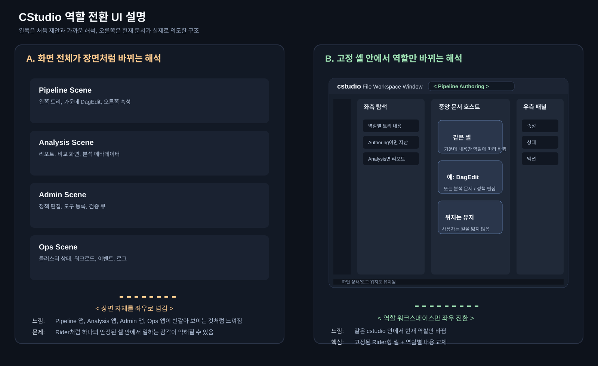

# 역할 전환 UI 설명용 비교 그림 v1

이 문서는 `cstudio` 역할 전환 구조를 더 직관적으로 설명하기 위한 비교 그림 문서다.

미리보기 자산:

## 보는 법

- 왼쪽: 화면 전체가 장면처럼 바뀌는 해석
- 오른쪽: 현재 `cstudio` 문서가 의도한 고정 셸 + 역할 전환 해석

## 핵심 메시지

`cstudio`는 오른쪽 구조를 목표로 한다.

즉 `< >` 전환은 장면 전체 교체가 아니라, 같은 셸 안에서 역할별 작업공간을 바꾸는 동작이다.
