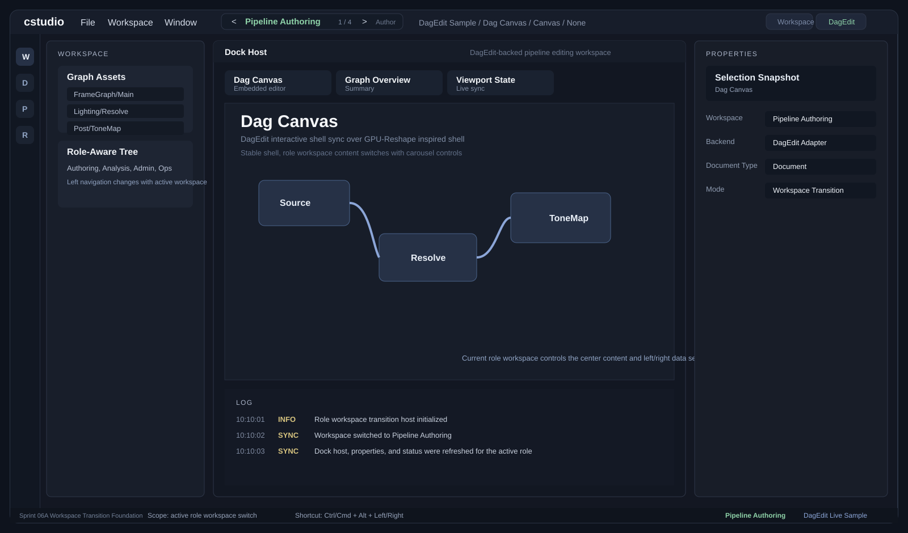

# 역할 전환 UI 미리보기 v1

이 문서는 `cstudio`의 `Sprint 06A Workspace Transition Foundation` 구현 방향을 GitHub에서 바로 볼 수 있게 정리한 미리보기다.

미리보기 자산:

## 이번 화면의 핵심

- 상단 크롬에 `< >` 기반 역할 워크스페이스 전환 컨트롤 추가
- 현재 워크스페이스 이름과 순번 표시
- 셸 프레임은 유지하고, 좌측 탐색/중앙 문서/우측 패널/하단 상태만 역할별로 교체
- 초기 순환 대상:
  - `Pipeline Authoring`
  - `Pipeline Analysis`
  - `Tool Administration`
  - `K8s Operations`

## 의도

이 구조는 앱 전체를 완전히 다른 화면으로 갈아엎는 방식이 아니다.

대신 Rider형 셸을 유지한 채, 최상위 메인 워크스페이스만 좌우로 회전 전환하는 모델이다.

## 현재 구현 기준 해석

- `Pipeline Authoring`은 기존 `DagEdit` 기반 편집 경로를 대표 역할로 사용
- 나머지 워크스페이스는 역할별 성격이 다른 샘플 문서/탐색/상태 구성을 사용
- 전환 제어는 상단 크롬의 `< >` 버튼과 키보드 단축키를 함께 상정

## 아직 남은 작업

- 권한별 워크스페이스 노출 규칙
- 전환 애니메이션 정교화
- 역할별 좌측 탐색 및 기본 랜딩 화면 심화
- 실제 도메인 어댑터와의 연결 확대
