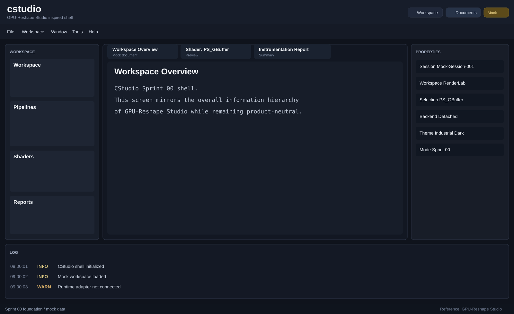

# Sprint 00 Screenshot Note

## Overview

Sprint 00 delivers the first `cstudio` shell preview based on the information layout of `GPU-Reshape Studio`.

This sprint uses a repository-rendered preview image so the result can be inspected directly on GitHub.

## Preview

## Included Areas

- top title and menu region
- left workspace/navigation column
- center document tabs and primary content area
- right properties panel
- bottom log panel
- bottom status strip

## Notes

- This preview reflects the implemented shell composition in Sprint 00.
- Runtime integration is intentionally mocked at this stage.
- Later sprints should replace this preview-style artifact with real captured application screenshots when the environment supports repeatable UI capture.
