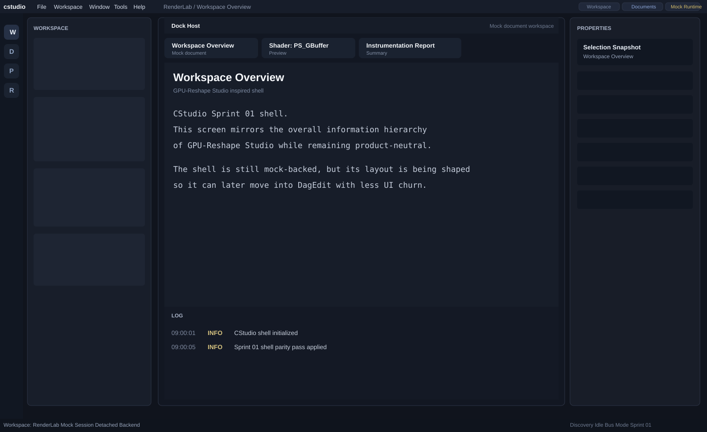

# Sprint 01 Screenshot Note

## Overview

Sprint 01 refines the shell toward the broad structure of `GPU-Reshape Studio`.

This sprint again uses a repository-rendered preview image so the result can be reviewed directly on GitHub.

## Preview

## Changes From Sprint 00

- thinner top chrome and menu layout
- explicit workspace label in the title strip
- right-side action badges
- left tool rail
- central dock-host framing
- bottom status split into left and right groups
- document activation path in the mock shell

## Notes

- This remains a product-neutral shell.
- Runtime and discovery behavior are still mock-backed.
- Next sprints can focus on tool/detail parity and adapter-ready shell contracts.

## Status

Completed and published to GitHub.
