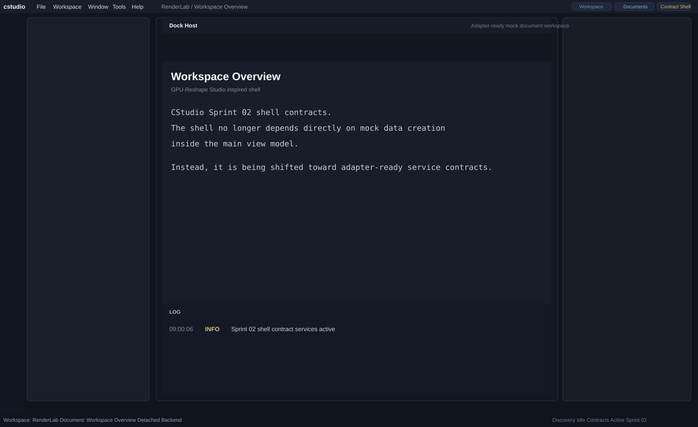

# Sprint 02 Screenshot Note

## Overview

Sprint 02 focuses on shell contracts rather than a dramatic visual redesign, but the GitHub-viewable preview is still updated because the shell state and chrome labels changed.

## Preview

## Visual Signals For This Sprint

- contract-oriented shell badge
- Sprint 02 status markers
- selection-driven shell labeling
- mock-backed but adapter-ready composition

## Notes

- This sprint is primarily architectural.
- The preview exists to keep the visible GitHub state aligned with the current implementation.

## Status

Completed and published to GitHub.
