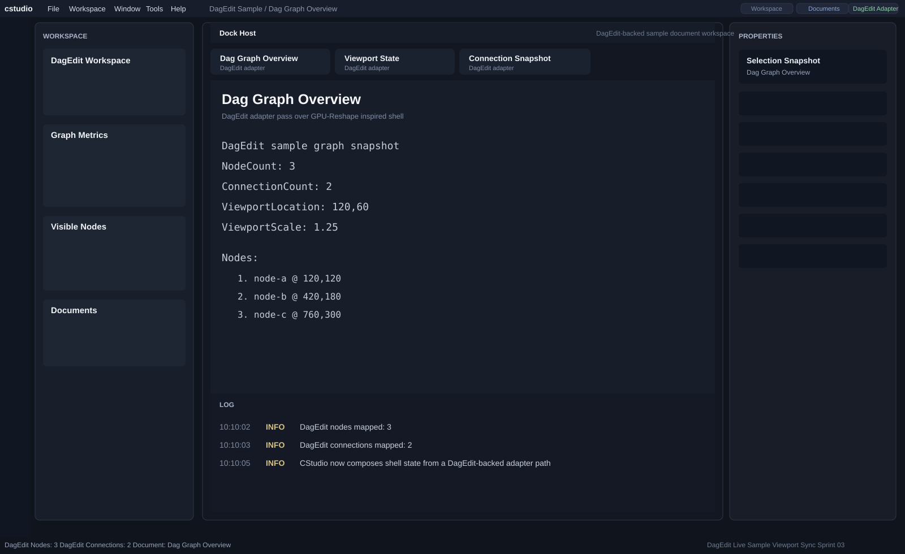

# Sprint 03 Screenshot Note

## Overview

Sprint 03 introduces the first DagEdit-backed adapter pass.

The shell is still shaped like the GPU-Reshape-inspired host, but the visible content now reflects a sample DagEdit state routed through the cstudio shell contracts.

## Preview

## Visual Signals For This Sprint

- `DagEdit Adapter` action badge
- DagEdit-derived workspace label
- DagEdit node/connection metrics in status and workspace sections
- DagEdit-oriented document titles and property values

## Notes

- This is the first adapter pass, not full application embedding.
- The shell remains reusable; DagEdit is mapped through the contract layer.

## Status

Completed and published to GitHub.
