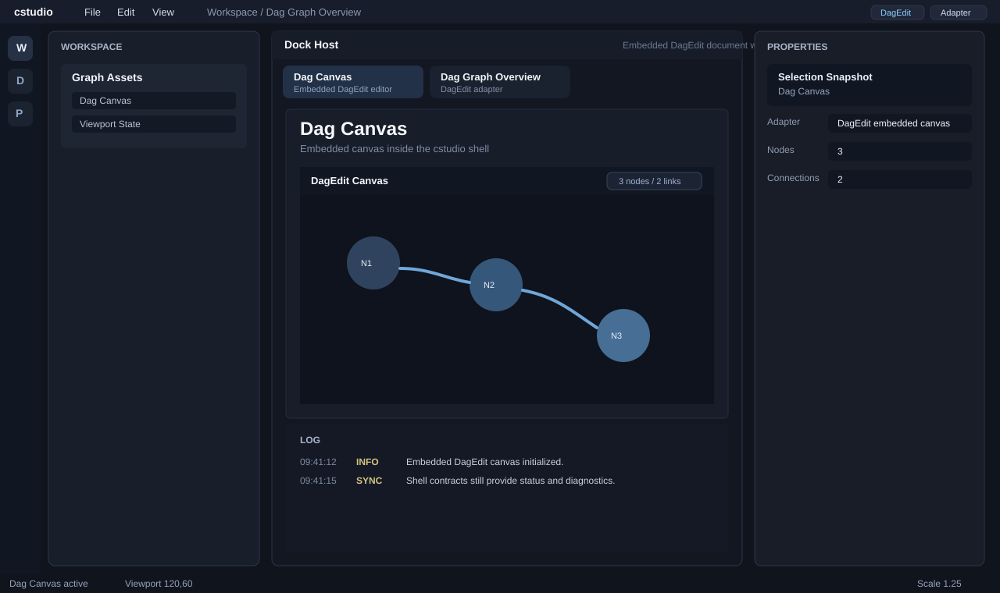

# Sprint 04 스크린샷 노트

## 개요

Sprint 04에서는 중앙 텍스트 패널을 임베드된 `DagEdit` 편집 표면으로 교체했다.

전체 셸은 계속 `GPU-Reshape Studio` 참고 프레임을 유지하지만, 이제 기본 문서 탭은 `cstudio` 내부에서 실제 그래프 캔버스를 렌더링한다.

## 미리보기

## 이번 스프린트의 시각적 신호

- 첫 번째 문서 탭이 `Dag Canvas`로 바뀜
- 중앙 문서 영역에 실제 그래프 편집기가 표시됨
- 캔버스 헤더에 노드/링크 수가 함께 표시됨
- 진단용 텍스트 문서 탭도 함께 유지됨

## 참고 사항

- 이번 스프린트는 편집 표면 임베드까지가 범위이며, 캔버스 내부 상호작용을 모든 셸 패널에 완전히 되돌려 연결하는 작업은 아직 아님
- 선택 흐름 강화는 Sprint 05에서 진행

## 상태

완료 및 GitHub 반영됨.
