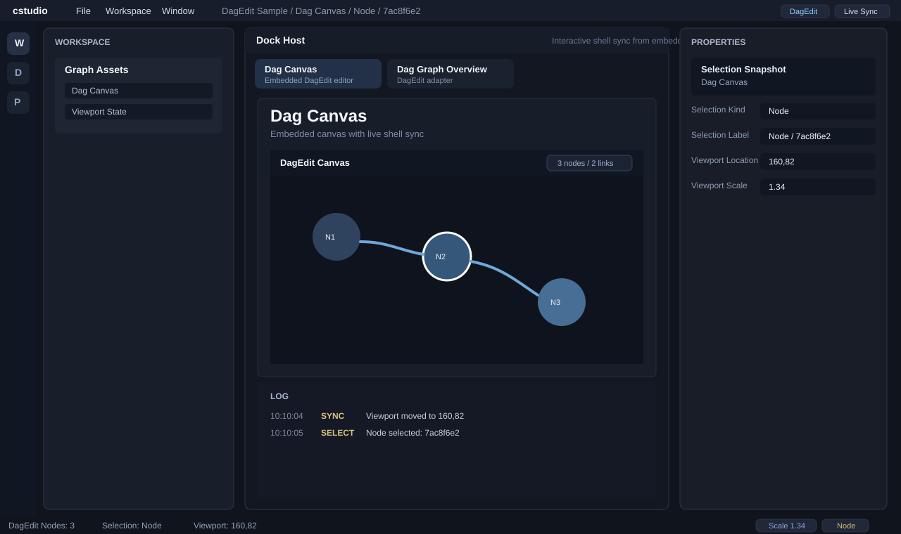

# Sprint 05 Screenshot Note

## Overview

Sprint 05 makes the surrounding shell react to the embedded `DagEdit` canvas.

The center editor is still embedded as in Sprint 04, but the visible UI chrome around it now reflects live viewport and selection state instead of staying static.

## Preview

## Visual Signals For This Sprint

- workspace label includes the active selection summary
- left status region shows `Selection` and live `Viewport`
- right badges show live `Scale` and selection kind
- properties panel exposes `Selection Kind`, `Selection Label`, and live viewport values
- log panel shows recent sync and selection events from the embedded canvas

## UI Notes

- this sprint changes visible shell UI, not only internal contracts
- the visual target is to make the shell feel connected to the embedded editor rather than a detached host

## Status

Completed and published to GitHub.
